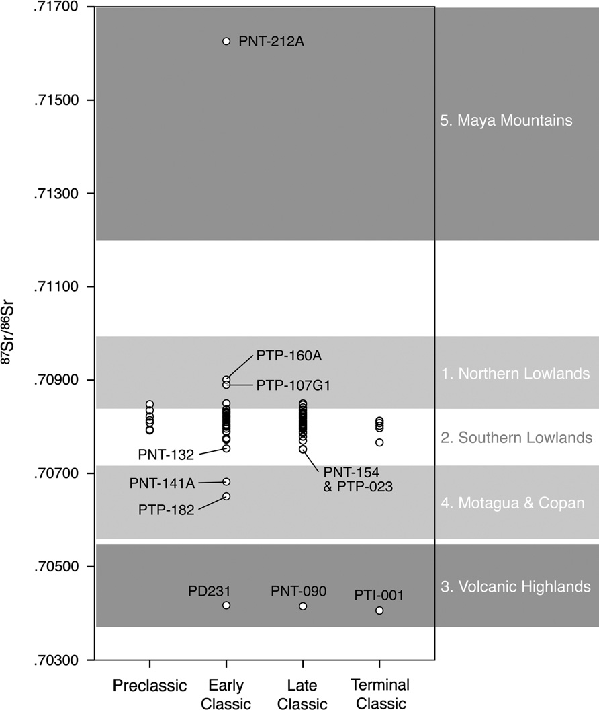
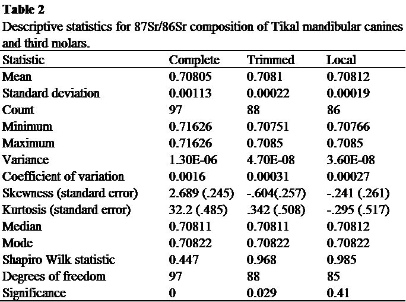
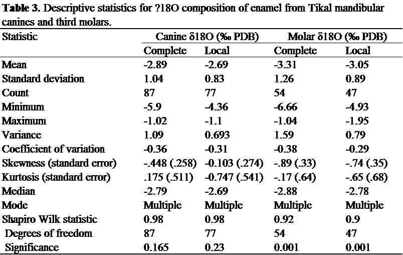
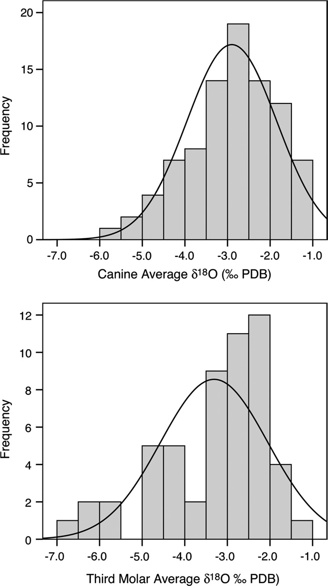
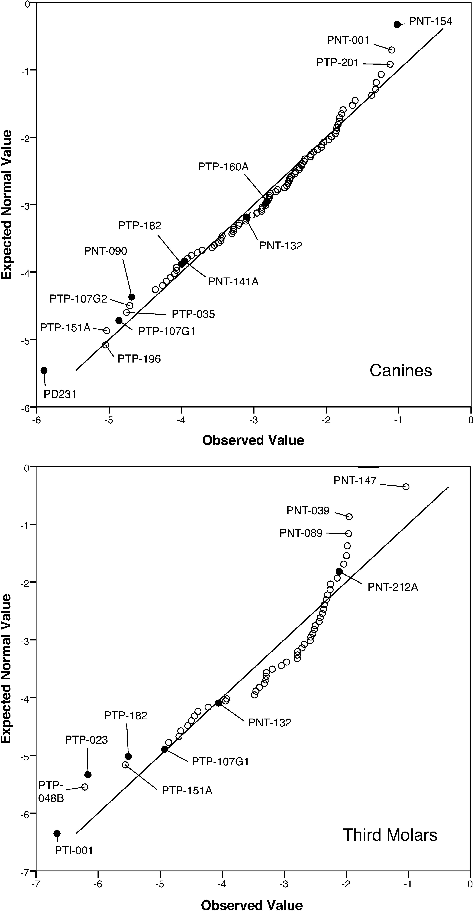
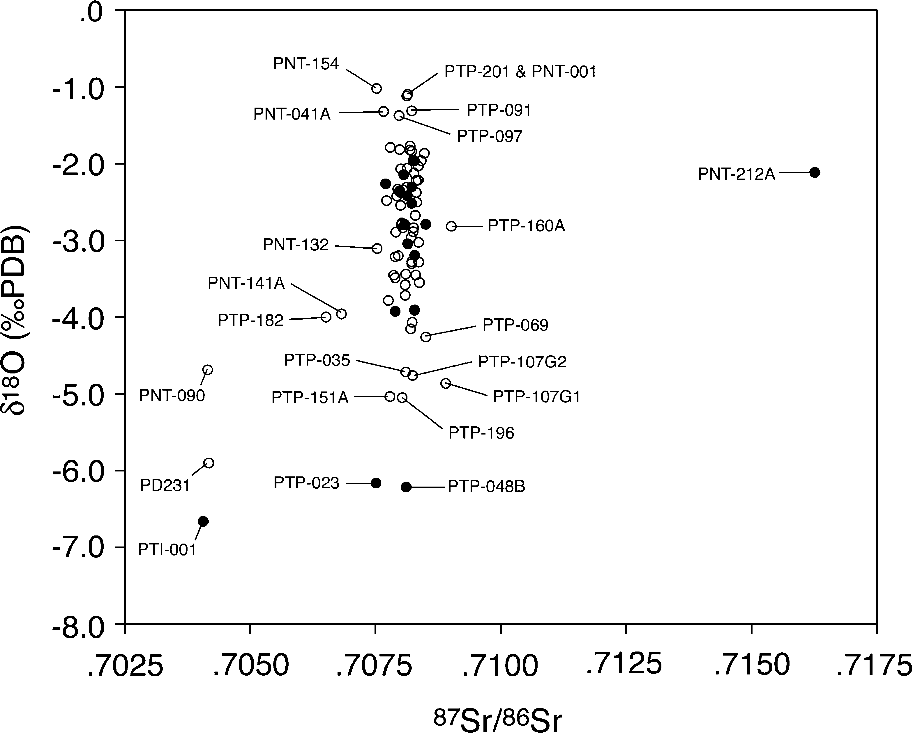

```{r setup, include=FALSE}
knitr::opts_chunk$set(echo = TRUE)
knitr::opts_chunk$set(
    fig.path = "img/"
)
```


## Introduction

Wright (2012) investigates migration from the ancient Maya site of Tikal in Guatemala. She presents oxygen and strontium isotopic data from dental samples from 136 ancient individuals. The individuals included in her analysis span the Preclassic (400 BCE - 250 CE) to Terminal Classic (800CE - 900CE) in an attempt to parcel out periods of time where immigration may have been more prominent than others. Wright (2012) showcases that approximately 11-16% of the sampled population were non-local to the site of Tikal. The majority of these non-local individuals were high status "elites" from the Early Classic (250 - 550 CE); however, "commoner" immigrants were identified in household burials from both the Early and Terminal Classic periods. Wright (2012) concludes that while Tikal depended on immigration of elites to help establish their strength as a polity, immigrants from all socioeconimic backgrounds contributed to the city's expansion and growth.

Wright's (2012) dataset provides contextual information for 134 individuals excavated at Tikal. She provides strontium (Sr) isotope ratios for 97 individuals and oxygen (O) isotope ratios for 123 of them. 86 individuals have both strontium and oxygen isotope ratios, which is beneficial to being able to parcel out geographic differences in instances where isotope ratios of a single system from region-A may overlap with isotope ratios from a different region. This is why she provides a range in possible immigrants. 


## Visualization of Data
To examine who is local and who is not, Wright provides basic descriptive statistical analyses for both the Sr and O isotope data (mean, standard deviation, count, min, max, variance, standard error, median, and mode). 

She also completes a Shapiro Wilk statistical test to examine degrees of freedom and significance. 

Finally, she provides several images in her analysis. Some compare her data to isotope data previously collected from other ancient sites throughout the Maya world, others test for normal distributions in her dataset, while another compares the two isotope systems to one another. 

For this exercise, I will replicate all of the descriptive statistical analyses (including the Shapiro Wilk test), histograms (Fig. 4), Q-Q Plots (Fig. 5), and multivariate analysis/scatterplot (Fig. 6).

First, load {tidyverse} and {curl}. Then, load the Wright 2012 dataset. 

```{r}
library(tidyverse)
library(curl)
f <- curl("https://raw.githubusercontent.com/ajlocker/Locker-Angelina-ADA-DATA-REANALYSIS-ASSIGNMENT/master/Wright-2012.csv")
d <- read.csv(f, header = TRUE, sep = ",", stringsAsFactors = FALSE)
d <- as_tibble(d)  
head(d)
```

## Replications/Reanalysis
The first thing I am going to replicate is Fig. 2 in which Wright (2012) compares the Time Period (or Date) of the burials to 87Sr/86Sr. Load (and install, if necessary) the {ggplot2} package.


```{r}
library(ggplot2) 

#First, I reset my Dates to numbers, so that they will plot in the correct chronological order
d[d == "Preclassic"] <- 1 
d[d == "Early Classic"] <- 2
d[d == "Late Classic"] <- 3
d[d == "Terminal Classic"] <- 4
d[d == "Postclassic"] <- 5

#Next, I assign them labels for the scatter plot
d$Date = factor( 
  d$Date, levels = 1:5, 
  labels = c("Preclassic", "Early Classic", "Late Classic", "Terminal Classic", "Postclassic") 
) 

#Now I am ready to set up my scatterplot in ggplot2
srp <- ggplot(data = d, aes(x = d$Date, y = d$X87Sr.86Sr)) # Data tells you which file to pull from; aes lets you set up your x,y plot.                           
srp <- srp + xlab("") + ylab("87Sr/86Sr")  
srp <- srp + geom_point(na.rm = TRUE)  
srp  # and, finally, we plot the object

```

Next, I examine the destriptive statistics for strontium isotope ratios and oxygen isotope ratios. Wright provides three columns in her tables. The first column lists all of the included data  points ("Complete"), the second removes obvious geologically distant samples ("Trimmed"), and the third further removes outliers ("Local"), such that the population distribution becomes a normal distribution when the Shapiro-Wilks test is completed. I completed the first ("Complete") and third ("Local") columns for her descriptive statistics. She did not specify which outliers she removed for the Trimmed, but did specify the parameters for the Local. 

To generate Table 2. we need to create multiple piplines using the %>% function. To get started (install if necessary and) load the {dplyr},{tidyverse}, and {e1071} packages. Eacy of these packages will help with descriptive stats. {dplyr} allows pipelines to be created to stream the data together in a single file. {e1071} carries the skewness and kurtosis statistics. 


```{r}
library(dplyr)
library(tidyverse)
library(e1071)

#The Mode() function in baseR tells you the class of an object. The get the mathematical mode (or the most frequent number), we have to create our own function: 

Mode <- function(x) {
    if (is.numeric(x)) {
        x_table <- table(x)
        return(as.numeric(names(x_table)[which.max(x_table)]))
    }
}

#Now we can build our descriptive statistics pipeline. 
SrComplete <- d %>%
  select(X87Sr.86Sr) %>% #here I am telling R which column from my dataset to pull from
  summarise(mean = mean(X87Sr.86Sr, na.rm = TRUE), #now I can go through and put in the statistical parameters I want
            sd = sd(X87Sr.86Sr, na.rm = TRUE),
            count = length(na.omit(X87Sr.86Sr)),
            min = min(X87Sr.86Sr, na.rm = TRUE), 
            max = max(X87Sr.86Sr, na.rm = TRUE),
            CV = sd(X87Sr.86Sr, na.rm = TRUE)/ mean(X87Sr.86Sr, na.rm = TRUE),
            skewness = skewness(X87Sr.86Sr, na.rm = TRUE, type = 3),# We are measuring skewness here to check out the relative symmetry of the distribution of data. So, we're looking the size of the two tails. A normal distribution should have a skewness of 0.
            kurtosis = kurtosis(X87Sr.86Sr, na.rm = TRUE, type = 3), #Kurtosis looks at the size of the two tails, collectively. If this value is larger than three, the data is not normally distributed. So, in evaluating the numbers, we are seeking to see how much of the data fall in the tails. A negative value means that the data has less in the tails than a typical distribution would. Conversely, if the kurtosis value is positive, the data has more in the tails than a normal distribution.
            median = median(X87Sr.86Sr, na.rm = TRUE),
            SrMode = Mode(X87Sr.86Sr))

SrLocal <- d %>%
  select(X87Sr.86Sr) %>%
  filter(X87Sr.86Sr > 0.70766, X87Sr.86Sr < 0.70850) %>% #here I am filtering the dataset to only count for the 'local' isotope ratios, as defined by Wright(2012)
  summarise(mean = mean(X87Sr.86Sr, na.rm = TRUE),
            sd = sd(X87Sr.86Sr, na.rm = TRUE),
            count = length(na.omit(X87Sr.86Sr)),
            min = min(X87Sr.86Sr, na.rm = TRUE), 
            max = max(X87Sr.86Sr, na.rm = TRUE),
            CV = sd(X87Sr.86Sr, na.rm = TRUE)/ mean(X87Sr.86Sr, na.rm = TRUE),
            skewness = skewness(X87Sr.86Sr, na.rm = TRUE, type = 3),
            kurtosis = kurtosis(X87Sr.86Sr, na.rm = TRUE, type = 3), 
            median = median(X87Sr.86Sr, na.rm = TRUE),
            SrMode = Mode(X87Sr.86Sr))

SrStats <- rbind(SrComplete, SrLocal)
SrStats


                  

```

I couldn't figure out how to sync up my dplyr tables with the Shapiro-Wilk test, so I'm just doing them separately. Sorry!

```{r}
SrCompShapiro <- shapiro.test(d$X87Sr.86Sr)
SrLocalShapio <- shapiro.test(d$X87Sr.86Sr)

SrShapiro <- rbind(SrCompShapiro, SrLocalShapio)
SrShapiro


```


Table 3. Canines and Molars (Repeat code from Table 2. However, use the Average.d18o.Canines and Average.d18o.Molars columns from the dataset)



```{r}
CaninesComplete <- d %>%
  select(Average.18O.canines) %>%
  summarise(mean = mean(Average.18O.canines, na.rm = TRUE),
            sd = sd(Average.18O.canines, na.rm = TRUE),
            count = length(na.omit(Average.18O.canines)),
            min = min(Average.18O.canines, na.rm = TRUE), 
            max = max(Average.18O.canines, na.rm = TRUE),
            CV = sd(Average.18O.canines, na.rm = TRUE)/ mean(Average.18O.canines, na.rm = TRUE),
            skewness = skewness(Average.18O.canines, na.rm = TRUE, type = 3),
            kurtosis = kurtosis(Average.18O.canines, na.rm = TRUE, type = 3), 
            median = median(Average.18O.canines, na.rm = TRUE),
            O_Mode = Mode(Average.18O.canines))

MolarsComplete <- d %>%
  select(Average.18O.molars) %>%
  summarise(mean = mean(Average.18O.molars, na.rm = TRUE),
            sd = sd(Average.18O.molars, na.rm = TRUE),
            count = length(na.omit(Average.18O.molars)),
            min = min(Average.18O.molars, na.rm = TRUE), 
            max = max(Average.18O.molars, na.rm = TRUE),
            CV = sd(Average.18O.molars, na.rm = TRUE)/ mean(Average.18O.molars, na.rm = TRUE),
            skewness = skewness(Average.18O.molars, na.rm = TRUE, type = 3),
            kurtosis = kurtosis(Average.18O.molars, na.rm = TRUE, type = 3), 
            median = median(Average.18O.molars, na.rm = TRUE),
            O_Mode = Mode(Average.18O.molars))

OxygenStats <- rbind(CaninesComplete, MolarsComplete)
OxygenStats
```

```{r}
CanineShapiro <- shapiro.test(d$Average.18O.canines)
MolarShapiro <- shapiro.test(d$Average.18O.molars)
OShapiro <- rbind(CanineShapiro, MolarShapiro)
OShapiro

```
Fig. 4 is two histograms comparing the distributions of averages of d18O from canines and molars with a normal distribution line plotted over them. We can use {ggplot2} for shortened code. Note: I'm still not sure why my distribution lines a plotting so small.



```{r}

ggplot(data = d, aes(d$Average.18O.canines)) + #tells us our data to pull from
  geom_histogram(na.rm = TRUE, #which type of plot we'll be using and the parameters
                 breaks = seq(-7, 0, by = 0.5), #I've used binwidth() and bins() along with breaks() to make my bins fall on whole numbers. If I don't use breaks() then the histogram plots on half numbers for the x-axis tick marks, rather than whole numbers. 
                 binwidth = 0.5,
                 bins = 15,
                 col = "blue",
                 fill = "red", 
                 probability = FALSE) +
  geom_density(col= "green") + #this creates the normal distribution line. 
  labs(x = "Canine Average"~delta*'18O(\u2030PDB)', y = "Frequency") +
  xlim(c(-7.0, 0.0)) + 
  ylim(c(0,20)) 

ggplot(data = d, aes(d$Average.18O.molars)) + 
  geom_histogram(na.rm = TRUE,
                 breaks = seq(-7, 0, by = 0.5),
                 binwidth = 0.5,
                 bins = 10,
                 col = "blue",
                 fill = "red",
                 probability = FALSE) +
  geom_density(col="green") +
  labs(x = "Third Molar Average"~delta*'18O(\u2030PDB)', y = "Frequency") + #Note: the \u2030 is code for the permille symbol. ~delta* notes that there should be a space after "Average", then a small delta symbol with no space between it and the 18. 
  xlim(c(-7.0, 0.0)) + 
  ylim(c(0,12))


```

Fig. 5 = QQ Plots of oxygen isotope data using {ggplot2}

```{r}

qc <- ggplot(d, aes(sample = d$Average.18O.canines)) + #tells us which data to pull from
  stat_qq(na.rm = TRUE) + #type of plot
  stat_qq_line() + #adds the expected line
  labs(title = "Canine QQ")

qm <- ggplot(d, aes(sample = d$Average.18O.molars)) +
  stat_qq(na.rm = TRUE) +
  stat_qq_line() +
  labs(title = "Molars QQ")

qc
qm
```

Fig. 6 Finally, We will plot a multivariate scatterplot comparing strontium isotope ratios to oxygen isotope ratios using {ggplot2}



```{r}

library(ggplot2) #load in the {ggplot2} package
sro <- ggplot(d, aes(x = d$X87Sr.86Sr, y = d$Average.18O.canines, d$Average.18O.molars), colours(distinct = TRUE)) + # Data tells you which file to pull from; aes lets you set up your x,y plot.                           
  geom_point(na.rm = TRUE) + 
  xlab("87Sr/86Sr") + ylab('d18O(\u2030PDB)')
sro  # and, finally, we plot
```

## Summary
Summary statistics using {dplyr}: summarise(), filter(), %>%

Data Normality Checks: Shapiro.Wilks Testing, Skewness, Kurtosis, QQ Plots

Plotting histograms with normal distribution lines usins {ggplot2}: ggplot(data = , aes(x,y)) + geom_histogram + geom_density()...

Plotting QQ plots with {ggplot2}: ggplot(data = , aes(sample = )) + stat_qq() + stat_qq_line() + labs()...

Generating a scatterplot with {ggplot2}: ggplot(data = , aes(x, y)) + geom_point + xlab + ylab...


## References

#Cheatsheets for R are probably the best thing in my life these days...

dplyr cheatsheet: https://www.rstudio.com/resources/cheatsheets/

ggplot2 cheatsheet: https://www.rstudio.com/resources/cheatsheets/

R Markdown Cheatsheet: https://www.rstudio.com/wp-content/uploads/2015/02/rmarkdown-cheatsheet.pdf

https://ggplot2.tidyverse.org/reference/geom_qq.html

https://blog.exploratory.io/filter-data-with-dplyr-76cf5f1a258e

Kabacoff, Robert I.2011. *R in Action: Data Analysis and Graphics with R* Manning Publications: Shelter Island, NY.


